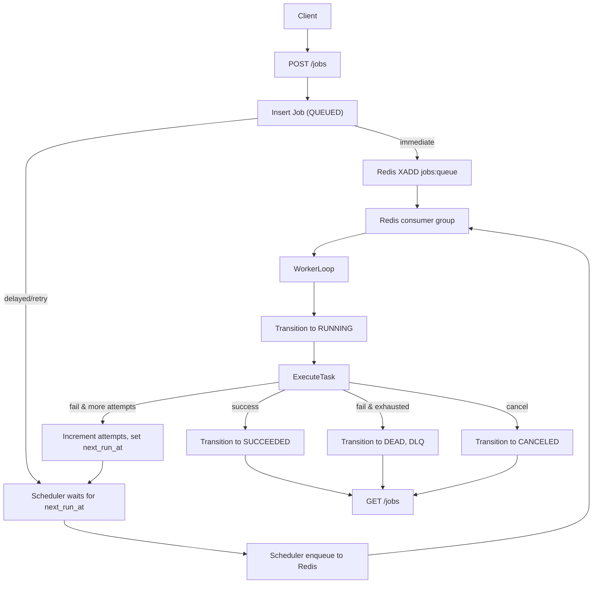

## High-level architecture

- **Services**: Implement three Python services (API, worker, scheduler) sharing a common code package plus a separate CLI entrypoint.
- **Core package**: Create a `miniqueue` (working name) package under `src/` that contains domain models, persistence layer, broker abstraction, task registry, worker engine, scheduler logic, and observability helpers.
- **Data stores**: Use Redis Streams for job transport and SQLite (via SQLModel) for persistent job metadata and job event log.
- **Concurrency model**: Use asyncio-based workers (multiple async tasks in a single process) for job execution; expose configuration via environment variables.
- **Observability**: Centralize JSON logging and Prometheus metrics in shared modules so all services and tests reuse the same counters, histograms, and log format.

## Project structure

- **Top level**
  - `pyproject.toml`: Poetry/PEP 621-style metadata and dependencies (FastAPI, Uvicorn, redis, SQLModel, aiosqlite, pydantic, typer, prometheus_client, pytest, ruff, mypy, httpx, python-dotenv if needed).
  - `Makefile`: Targets `test`, `lint`, `up`, `down`, `loadtest` (wrapping Docker Compose and pytest/ruff/mypy).
  - `docker-compose.yml`: Define services `redis`, `api`, `worker`, `scheduler` using a shared app image built from `Dockerfile`.
  - `Dockerfile`: Build a single Python 3.12 image with app code, install dependencies, and configure env vars and default command.
  - `README.md`: Document architecture, endpoints, failure modes, assumptions, how to add tasks, and how to run/tests.
  - `config/schedules.yml`: Define recurring schedules with `id`, `job_type`, `queue`, `payload`, `interval_seconds`, and job options.
- **Python package `src/miniqueue/`**
  - `__init__.py`: Version and basic exports.
  - `config.py`: Pydantic settings class for shared configuration (Redis URL, DB URL, queue names, consumer group, visibility timeout, scheduler interval, metrics ports, etc.).
  - `logging.py`: JSON logging setup (custom `logging.Formatter`), context helpers to add `job_id`, `stream_id`, `consumer`, `attempt`, `state`, and `service` to logs.
  - `metrics.py`: Define and register Prometheus metrics (`jobs_enqueued_total`, `jobs_started_total`, `jobs_finished_total`, `job_duration_seconds`, `queue_depth`, `worker_reclaims_total`, `scheduler_enqueues_total`) with helper functions for updates.
  - `db.py`: SQLModel engine/session factory, migration helper (create tables on startup), and context managers for DB sessions (sync or async via `sqlmodel.Session`).
  - `models.py`: Domain enums and SQLModel tables:
    - `JobState` enum: `QUEUED`, `RUNNING`, `SUCCEEDED`, `FAILED`, `CANCELED`, `DEAD`.
    - `Job` model: fields per spec plus `queue`, `is_enqueued` (bool), `cancel_requested` (bool), and any internal fields (`run_at` aliasing `next_run_at` as needed).
    - `JobEvent` model: append-only event log with `id`, `job_id`, `ts`, `old_state`, `new_state`, `message`, `metadata` (JSON).
    - Optional `ScheduleTick` model for recurring schedules with `schedule_id`, `planned_time`, `enqueued_at` to dedupe ticks.
  - `state_machine.py`: Functions to perform validated state transitions, encapsulating rules (e.g., only `QUEUED` → `RUNNING`, `RUNNING` → terminal states, `FAILED/DEAD` → `QUEUED` on retry) and writing `JobEvent` rows.
  - `broker.py`: Redis Streams abstraction:
    - Configure stream names (`jobs:{queue}`, `jobs:dlq`), consumer group (create at startup if missing).
    - `enqueue_job(job)` that `XADD`s job to proper stream and increments `jobs_enqueued_total`.
    - `read_jobs(consumer_name, count, block_ms)` using `XREADGROUP` and returning parsed messages (including `stream_id`).
    - `ack_job(stream_id)` performing `XACK` after DB commit.
    - `reclaim_stuck(consumer_name, min_idle_ms)` using `XAUTOCLAIM` (or `XPENDING`/`XCLAIM`) to take ownership of stale messages and increment `worker_reclaims_total`.
    - `queue_depth(queue)` querying `XLEN`/`XPENDING` to update the `queue_depth` gauge.
  - `tasks/` package:
    - `__init__.py`: task registry API (register/lookup), base `TaskContext` type (with DB session, cancellation checker, logger, settings), and decorator for registering task types.
    - `builtin_tasks.py`: implement required tasks using Pydantic payload models:
      - `sleep`: async sleep for `n` seconds, checking cancellation between iterations.
      - `http_get`: perform an HTTP GET using `httpx`, with timeout and result body/HTTP code.
      - `cpu_burn`: run a CPU-bound loop for N iterations or seconds.
      - `fail_then_succeed`: fail for first K attempts (based on `attempt` from context) then succeed.
      - `pipeline_demo`: multi-step sequence combining `sleep`, `http_get`, and local computations, checking cancellation between steps.
  - `worker.py`: Worker service logic (no FastAPI):
    - Async entrypoint that:
      - Initializes settings, DB, Redis broker, logging, metrics HTTP server.
      - Spawns N concurrent async worker loops (tasks) and a periodic reclaim loop and queue-depth metrics loop.
    - Worker loop algorithm per message:
      - Read from Redis Streams via broker.
      - Within a DB session/transaction:
        - Look up `Job` by `job_id` (from stream fields).
        - If not found or already in terminal state with idempotency semantics, `XACK` and continue.
        - If `cancel_requested` is true before starting, transition to `CANCELED`, persist and `XACK`.
        - Otherwise perform state transition `QUEUED` → `RUNNING`, record `JobEvent`, update metrics (`jobs_started_total`).
      - Execute the mapped task, passing `TaskContext` with a cooperative `check_canceled()` which reloads the job and raises a `JobCanceled` exception if `cancel_requested` is set.
      - Measure duration and record `job_duration_seconds` histogram.
      - On success:
        - Persist `result`, transition to `SUCCEEDED`, record `JobEvent`, update `jobs_finished_total{state="SUCCEEDED"}`.
      - On `JobCanceled`:
        - Transition to `CANCELED` and update metrics.
      - On other exceptions:
        - Increment `attempts` and compute exponential backoff `next_run_at` with jitter; if `attempts` < `max_attempts`, set `state=QUEUED`, `is_enqueued=False`, `next_run_at` to backoff timestamp and leave it for scheduler; otherwise set `state=DEAD`, push an entry to `jobs:dlq`, and update metrics.
      - Commit DB transaction, then `XACK` the stream entry only after successful commit.
  - `backoff.py`: Pure functions for retry backoff (base delay, multiplier, cap, jitter); designed to be easily unit-tested (with injectable random).
  - `scheduler.py`: Scheduler service logic:
    - Async loop that periodically:
      - Finds delayed/retry jobs: `state=QUEUED`, `is_enqueued=False`, `next_run_at <= now`, not canceled.
      - For each such job, enqueues to Redis via broker, sets `is_enqueued=True`, clears `next_run_at`, records an event, increments `jobs_enqueued_total` and `scheduler_enqueues_total{schedule_id="delayed"}`.
    - Loads recurring schedules from `config/schedules.yml` into Pydantic models at startup.
    - For each defined schedule, on each tick:
      - Compute the latest expected tick time based on `interval_seconds` (e.g., floor(now / interval) * interval).
      - Use `ScheduleTick` table to check if that (`schedule_id`, `planned_time`) was already enqueued; if not, insert a row and enqueue a new job with a deterministic `idempotency_key` (e.g., `f"{schedule_id}:{planned_time.isoformat()}"`), record an event, and update `scheduler_enqueues_total{schedule_id}`.
    - Start Prometheus metrics HTTP server and JSON logging similar to worker.
  - `api_app.py`: FastAPI app factory and routers:
    - Dependency-injected DB sessions and settings.
    - Models for request/response schemas (Pydantic models separate from SQLModel ORM models).
    - Endpoints:
      - `POST /jobs`: create job row in DB, enforce idempotency rule on `idempotency_key` (return existing non-terminal job), set initial state `QUEUED`, determine immediate vs delayed based on `run_at`, enqueue immediately via broker if no `run_at`, otherwise leave for scheduler. Return `{ "job_id": uuid }`.
      - `GET /jobs/{job_id}`: fetch job and return serialized record including state, attempts, result, last_error, schedule info.
      - `POST /jobs/{job_id}/cancel`: if `QUEUED` and not yet enqueued, set `state=CANCELED` and ensure `is_enqueued=False`; if `QUEUED` but already enqueued, mark `CANCELED` and log so worker recognizes; if `RUNNING`, set `cancel_requested=True` and log. Return updated job snapshot.
      - `POST /jobs/{job_id}/retry`: only if `state in {FAILED, DEAD}`; policy (documented) will reset `state=QUEUED`, `attempts=0`, `last_error` cleared, `is_enqueued` set according to immediate enqueue (no `run_at`), and enqueue via broker. Record `JobEvent` and metrics.
      - `GET /jobs`: list jobs with optional `state`, `type`, `limit`, `cursor` (simple numeric or created_at-based cursor), returning page of jobs and a next cursor if present.
      - `GET /jobs/{job_id}/events`: list recent events for a job for inspection / CLI tailing.
      - `GET /job_events`: tail global events with `limit` and optional `since` timestamp for CLI.
      - `GET /metrics`: expose Prometheus registry.
      - `GET /healthz`: check SQLite connectivity (simple query) and Redis ping; respond with overall status.
    - Mount FastAPI app with Uvicorn configuration for production-ish behavior.
  - `cli.py`: Typer-based CLI:
    - Global options for API base URL.
    - Commands:
      - `submit`: accepts `type`, `payload` JSON (string or file), optional `queue`, `max_attempts`, `run_at`, `idempotency_key`; calls `POST /jobs` and prints `job_id`.
      - `status`: fetch job by id and print state, attempts, result.
      - `cancel`: call `/jobs/{job_id}/cancel`.
      - `retry`: call `/jobs/{job_id}/retry`.
      - `tail`: periodically poll `/job_events` (e.g., every 1–2s) with `since` or cursor and print events in a compact text format.
      - `loadtest`: submit many jobs concurrently (e.g., using asyncio + httpx) of various types (e.g., `sleep`, `cpu_burn`) and compute throughput/latency stats, printing a summary.

## Failure handling & determinism

- **DB transactions & acking**: Wrap each job processing in a DB transaction; only `XACK` the Redis entry after a successful commit so that no job is lost even if the worker crashes mid-execution.
- **At-least-once & idempotency**:
  - Redis Streams consumer group provides at-least-once semantics; workers never `XDEL` jobs.
  - On startup, worker runs a reclaim loop (`XAUTOCLAIM` on messages older than `visibility_timeout_ms`) so that jobs from crashed workers are reassigned.
  - Job execution checks the DB state: if a job with the same `job_id` is already `SUCCEEDED` and has an `idempotency_key`, the worker will treat re-deliveries as no-op and just `XACK`, ensuring no duplicate side effects.
  - API-level idempotency enforces that a new `POST /jobs` with an existing non-terminal `idempotency_key` returns the existing job instead of creating a new one.
- **Retry and DLQ**: Central `compute_backoff` function ensures deterministic ranges; on exceeding `max_attempts`, jobs move to `DEAD` state and a minimal payload is written to the `jobs:dlq` stream.
- **Scheduler robustness**: Delayed jobs and retries rely on `next_run_at` and `is_enqueued` flags in DB, so scheduler restarts only risk at-least-once duplicate enqueues; recurring schedules are deduped by the `ScheduleTick` table keyed by `schedule_id + planned_time`.

## Observability and metrics design

- **JSON logging**: All services use the same logger factory to emit structured JSON with fields `timestamp`, `level`, `service`, `job_id`, `stream_id`, `consumer`, `attempt`, `state`, and free-form `message`.
- **Prometheus metrics**:
  - `jobs_enqueued_total{type,queue}`: incremented on API enqueue, scheduler enqueue, and retry scheduling.
  - `jobs_started_total{type}`: incremented when worker transitions `QUEUED` → `RUNNING`.
  - `jobs_finished_total{type,state}`: incremented on terminal transitions.
  - `job_duration_seconds{type}`: histogram around worker execution duration.
  - `queue_depth{queue}`: periodically set from Redis `XLEN`/`XPENDING`.
  - `worker_reclaims_total`: incremented whenever `XAUTOCLAIM` reclaims stuck jobs.
  - `scheduler_enqueues_total{schedule_id}`: incremented per scheduled tick, including a special `schedule_id="delayed"` for one-off delayed jobs.
- **Metrics endpoints**:
  - API: `GET /metrics` via FastAPI route.
  - Worker & scheduler: `prometheus_client.start_http_server(port)` with ports defined in settings and documented in README.

## Testing strategy

- **Unit tests (`tests/unit/`)**
  - `test_state_transitions.py`: Use in-memory SQLite and `state_machine` helpers to assert allowed/forbidden transitions and event creation for key paths (enqueue, start, succeed, fail, cancel, retry, dead).
  - `test_backoff.py`: Verify backoff computation for given attempt numbers stays within expected bounds (base, multiplier, cap) and that jitter is within "+/-" range; use a seeded RNG or dependency injection for determinism.
  - `test_idempotency.py`: Test API-level idempotency (repeated `POST /jobs` with same key and non-terminal state returns same job) and worker-level idempotency (simulate job re-delivery when already `SUCCEEDED` with an idempotency key).
- **Integration tests (`tests/integration/`)**
  - Use dockerized Redis and a temporary SQLite DB; fixtures will start a Redis container via `docker compose` (or `docker` Python SDK) and ensure it's running before tests.
  - `test_at_least_once_reclaim.py`: Start a worker against Redis, inject a job, simulate crash by stopping the worker mid-execution (e.g., via a task that sleeps and then raising an exception) and verify that another worker instance reclaims the message via `XAUTOCLAIM` and completes the job.
  - `test_dlq_after_max_attempts.py`: Use `fail_then_succeed` with `max_attempts=K` (or a task that always fails), run worker until attempts exhausted, assert job state is `DEAD` and a record exists in the `jobs:dlq` stream.
  - `test_delayed_job_runs_after_run_at.py`: Submit job with `run_at` in the near future, run scheduler + worker, assert it is not run before `run_at` and completes shortly after.
  - `test_scheduler_restart_no_duplicate_ticks.py`: Run scheduler with a recurring schedule, stop and restart it, and verify only one job per logical tick exists in DB for a given `schedule_id + planned_time`.
  - Wire these tests through `make test` so `make test` will bring up Redis (via `docker compose up -d redis`), run pytest, and then bring Redis down.

## CLI and load testing

- **CLI implementation**:
  - Use Typer for ergonomic commands and help.
  - Provide human-readable output while still including job IDs and states for scripting.
- **Load test command**:
  - `make loadtest` will run `python -m miniqueue.cli loadtest ...` or a small wrapper script.
  - The load test will submit a configurable number of jobs (default some hundreds) of mixed types, wait for their completion via polling `GET /jobs`, calculate overall throughput and percentile latency (e.g., P50, P95), and print results.

## Mermaid diagram: job lifecycle

## Implementation todos

- **setup-project**: Initialize `pyproject.toml`, `src/miniqueue` package, `Dockerfile`, `docker-compose.yml`, `Makefile`, and base `README.md`.
- **implement-persistence-and-models**: Implement `config`, `db`, `models`, and `state_machine` modules with SQLModel tables and core state transition logic.
- **implement-broker-and-tasks**: Implement `broker` abstraction over Redis Streams and the `tasks` package with built-in task types and registry.
- **implement-worker-service**: Implement `worker.py` with async worker loops, reclaim logic, metrics, and integration with state machine and tasks.
- **implement-scheduler-service**: Implement `scheduler.py` for delayed jobs and recurring schedules loaded from `config/schedules.yml`, plus metrics.
- **implement-api-service**: Implement `api_app.py` FastAPI app with required endpoints, health checks, and Prometheus metrics.
- **implement-cli-and-loadtest**: Implement `cli.py` (Typer) and wire `loadtest` command to work against the API.
- **add-tests**: Add unit and integration tests with pytest, configure `make test` to start Redis and run the suite.
- **lint-and-typecheck**: Configure ruff (and mypy if feasible) in `pyproject.toml` and add `make lint` target to run them.

