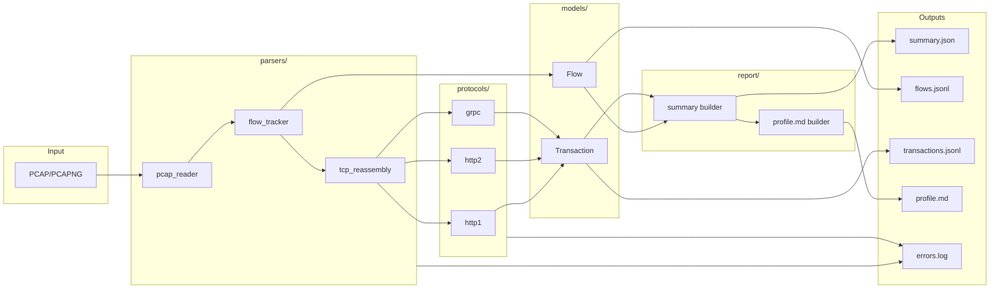

# Netprof: Offline Network Traffic Collector and Behavior Profiler

## Architecture Overview




- **Streaming**: PCAP read via iterator; flow tracker and reassembly consume packet-by-packet; outputs written incrementally (JSONL, log) or at end (summary.json, profile.md).
- **Plugin protocol**: Each protocol in `protocols/` implements a common interface: `detect(stream_bytes, direction) -> bool`, `parse(stream_bytes, ...) -> list[Transaction]`, and optional `name`. A registry or explicit list in config determines order of application (e.g., HTTP/2 preface first, then HTTP/1.1, then gRPC as HTTP/2 overlay).

---

## Directory Layout

```
netprof/
  __init__.py
  config.py              # pydantic settings + YAML load
  correlation.py         # flow_id, txn_id hashing (stable)
cli/
  __init__.py
  main.py                # entrypoint, typer/argparse
  analyze.py             # analyze subcommand
  summarize.py           # summarize subcommand
  fixtures_cmd.py        # fixtures generate
parsers/
  __init__.py
  pcap_reader.py         # stream PCAP/PCAPNG (dpkt UniversalReader)
  flow_tracker.py        # 5-tuple flows, RTT, bytes, concurrency
  tcp_reassembly.py      # in-order payload, out-of-order/retrans, bounded memory
protocols/
  __init__.py
  base.py                # ProtocolHandler ABC or protocol
  http1.py               # HTTP/1.1 request/response parsing
  http2.py               # HTTP/2 preface + frames + HPACK, stream extraction
  grpc.py                # gRPC detection + :path + message framing (no protobuf)
models/
  __init__.py
  flow.py                # Flow dataclass/Pydantic
  transaction.py         # Transaction (HTTP/gRPC) model
  summary.py             # Summary stats model
report/
  __init__.py
  summary_builder.py     # aggregate -> summary.json
  profile_md.py          # profile.md from summary + transactions
  errors.py              # centralized error logging -> errors.log
tests/
  conftest.py            # fixtures path, shared helpers
  test_flow_tracker.py
  test_tcp_reassembly.py
  test_http1.py
  test_http2.py
  test_grpc.py
  test_integration.py    # analyze fixtures -> assert summary + transactions
fixtures/                # generated by netprof fixtures generate (gitignore or committed)
  *.pcap
pyproject.toml
README.md
Makefile
config.example.yaml      # optional
```

---

## 1. Dependencies and Project Setup

- **pyproject.toml**: Python 3.12; dependencies: `dpkt` (pcap + pcapng via UniversalReader), `scapy` (fixture generation only), `h2`, `hpack`, `pydantic`, `pydantic-settings`, `pyyaml`, `typer` (CLI), `pytest`, `ruff`, `mypy`. Pinned versions for reproducibility.
- **Config**: Pydantic Settings with optional `config.yaml` path. Settings: `reassembly_buffer_per_flow_bytes`, `max_active_flows`, `concurrency_bucket_seconds`, `output_dir`, etc. Load YAML and merge with env/defaults.
- **CLI entry**: `[project.scripts]` → `netprof = cli.main:app` (Typer) or `netprof = cli.main:main`. Subcommands: `analyze`, `summarize`, `fixtures`.

---

## 2. PCAP Input (parsers/pcap_reader.py)

- Use **dpkt** `dpkt.pcap.UniversalReader` (dpkt >= 1.9.7) to support both .pcap and .pcapng in a single code path. Open file, iterate `(ts, buf)` without loading entire file.
- **Multi-file**: For `analyze <path>`, if path is a directory, discover `*.pcap` and `*.pcapng`, sort by name, and process in sequence; assign a stable `capture_file_id` (e.g., basename hash or index) for correlation.
- **Exception**: If UniversalReader or pcapng fails on the platform, catch and document in README; fall back to `dpkt.pcap.Reader` for .pcap only and document "PCAPNG not supported" in README.
- Emit a stream of normalized packet records: `(ts, src_ip, dst_ip, src_port, dst_port, protocol, payload)` where payload is TCP payload bytes (after IP/TCP headers); skip non-TCP or malformed.

---

## 3. Flow Reconstruction (parsers/flow_tracker.py)

- **Key**: 5-tuple `(src_ip, src_port, dst_ip, dst_port, protocol)`; **direction**: initiator = side that sent first SYN (client), other = server. Normalize so each flow has a single direction (client_to_server / server_to_client).
- **Per-flow state**: start_ts, end_ts, bytes_client_to_server, bytes_server_to_client, packet_count_client_to_server, packet_count_server_to_client, list of (ts, payload, direction) for reassembly (or pass to reassembler).
- **RTT**: On first SYN and SYN-ACK, record delta as estimated RTT; optionally use TCP timestamps if present (best-effort).
- **Concurrency**: Maintain active flow set keyed by 5-tuple; on each packet ts, bucket time into `concurrency_bucket_seconds` and track count of active flows per bucket; at end emit a simple timeline (list of (bucket_start_ts, count)).
- **Output**: When a flow ends (FIN/RST or timeout/eviction), emit a **Flow** model and feed its ordered payload stream to TCP reassembly.
- **Flow end detection**: Consider flow closed on FIN (both directions) or RST, or when no packet seen for a configurable timeout (e.g., 60s); optional: max flow duration to avoid unbounded state.

---

## 4. TCP Reassembly (parsers/tcp_reassembly.py)

- **Input**: Per-flow stream of (ts, payload, direction). Segments may be out-of-order or retransmitted.
- **Algorithm**: Per direction, maintain a byte buffer and a “next expected sequence” (from TCP seq numbers). Insert segments; discard duplicate bytes (retrans); fill gaps when possible; emit in-order contiguous data to application-layer parsers.
- **Bounded memory**: (1) Max bytes per flow per direction (e.g., 1 MB from config); (2) max number of active flows (evict oldest or least recently used when limit reached). When evicting, log to errors.log and do not parse application layer for that flow.
- **Output**: Reassembled client-to-server and server-to-client byte streams (or callbacks/chunks) plus timestamps for “first byte of segment” mapping to support request_ts/response_ts. Pass reassembled streams to protocol detectors.

---

## 5. Correlation IDs (correlation.py or models/)

- **flow_id**: Stable string hash of `(src_ip, src_port, dst_ip, dst_port, protocol, capture_file_id)`. Use a deterministic encoding (e.g., canonical tuple) and hash (e.g., SHA256 hex prefix or 64-bit hash).
- **txn_id**: 
  - HTTP/1.1: `flow_id + "_" + str(transaction_index)` (sequential per flow).
  - HTTP/2: `flow_id + "_s" + str(stream_id)`.
  - gRPC: same as HTTP/2 (stream_id).
- Expose helpers: `compute_flow_id(...)`, `compute_txn_id(flow_id, stream_id_or_index)`.

---

## 6. Application-Layer Protocols

### 6.1 HTTP/1.1 (protocols/http1.py)

- **Detection**: Reassembled stream starts with HTTP method token (GET, POST, …) or response "HTTP/1.x".
- **Parsing**: Split by \r\n\r\n for headers; parse request line (method, path, version) and status line (code); handle body by Content-Length or chunked (best-effort). For multiple transactions on same connection (keep-alive), scan for next request or response start.
- **Extract**: host (from Host header), method, path, status_code, request_headers subset, response_headers subset, request_bytes, response_bytes, request_ts (first byte of request), response_ts (first byte of response), end_ts (last byte). Latency = response_ts - request_ts (or first response byte minus first request byte).
- **Output**: One **Transaction** per request/response pair with txn_id = flow_id + "_" + index.

### 6.2 HTTP/2 (protocols/http2.py)

- **Detection**: Client sends preface `PRI * HTTP/2.0\r\n\r\nSM\r\n\r\n` (24 bytes). If this appears at start of client-to-server stream, treat as HTTP/2.
- **Parsing**: Use **h2** (and **hpack**) to parse frames. Maintain H2 connection state (or minimal state: decode SETTINGS, HEADERS, DATA). Parse HEADERS for :method, :authority, :path, :status; associate DATA with stream_id. Track first byte of request (HEADERS) and first byte of response (HEADERS with :status) and end of stream (last DATA or END_STREAM).
- **Extract**: :method, :authority, :path, :status, stream_id, start_ts, first_response_ts, end_ts, bytes_in/out per stream. Multiple streams per connection.
- **Output**: One Transaction per stream with txn_id = flow_id + "_s" + stream_id. Use **hpack** decoder for header blocks.

### 6.3 gRPC (protocols/grpc.py)

- **Detection**: Over HTTP/2 only. When parsing HTTP/2 streams, check header `content-type` for `application/grpc`. If present, mark stream as gRPC.
- **Extract**: RPC identity from `:path` (e.g., `/package.Service/Method`). Optionally parse gRPC message framing in DATA: 1 byte compressed flag + 4 bytes length (big-endian); count messages and sizes; do not decode protobuf.
- **Output**: Same Transaction type with optional grpc_method, grpc_service, message_sizes list; txn_id same as HTTP/2 stream.
- **Protocol order**: Run HTTP/2 detector first (preface); if HTTP/2, run frame parser and then gRPC detection per stream. If not HTTP/2, run HTTP/1.1 detector.

---

## 7. Models (models/)

- **Flow**: flow_id, capture_file_id, src_ip, src_port, dst_ip, dst_port, protocol, direction (initiator), start_ts, end_ts, duration_sec, bytes_client_to_server, bytes_server_to_client, packet_count_c2s, packet_count_s2c, estimated_rtt_ms (optional), concurrency_timeline (optional list of (ts, count)).
- **Transaction**: txn_id, flow_id, protocol (http1 | http2 | grpc), method, authority/host, path, status_code (optional), stream_id (optional), request_ts, response_ts, end_ts, latency_ms, request_bytes, response_bytes, grpc_service, grpc_method, message_sizes (optional). Use Pydantic or dataclasses; serialize to JSON for JSONL.
- **Summary**: top_talkers (list of {ip, bytes_sent, bytes_recv}), top_destinations, top_ports, active_flow_peaks (e.g., max concurrent flows), total_bytes, total_flows, latency_percentiles (p50, p90, p99 in ms for parsed HTTP transactions). Pydantic model for summary.json.

---

## 8. Report Generation (report/)

- **summary_builder.py**: From list of Flow and list of Transaction, compute top talkers (by IP, aggregate bytes), top destinations (by IP:port or host), top ports, total bytes/flows, latency percentiles (from Transaction.latency_ms). Emit **summary.json** (Pydantic model dump).
- **profile_md.py**: Human-readable **profile.md**: overview (total flows, bytes, parsed transactions), tables (top endpoints, status codes, latency percentiles), behavior profile (burstiness from concurrency timeline, heavy endpoints, long-tail latency).
- **errors.py**: Single module or logger that appends to **errors.log** (in output_dir): parse errors, truncated streams, “skipped TLS” or “unknown protocol”, reassembly evictions.

---

## 9. CLI Commands

- **netprof analyze **** --out **** [--config config.yaml]**
  - Resolve path (file or directory); load config; create output_dir; open errors.log (append). Stream packets → flow tracker → reassembly → protocols → collect Flow and Transaction lists; write flows.jsonl (one JSON per line), transactions.jsonl; then run summary_builder and profile_md; write summary.json and profile.md.
- **netprof summarize ****
  - Read flows.jsonl and transactions.jsonl from output_dir, recompute summary (summary_builder), print key metrics to stdout (and optionally overwrite summary.json).
- **netprof fixtures generate**
  - Create fixtures directory (e.g., `tests/fixtures` or `fixtures/`). Use **scapy** to build:
    - **HTTP/1.1 fixture**: One TCP session (SYN/SYN-ACK/ACK, then TCP segments with HTTP request, response, second request, second response; keep-alive). Write small .pcap.
    - **HTTP/2 fixture**: Use **h2** to generate valid client preface and a minimal SETTINGS + HEADERS + DATA exchange; embed these bytes into TCP payloads via scapy; write .pcap.
  - Deterministic (fixed ports, IPs, timestamps) so tests are reproducible.

---

## 10. Output Files (Required)


| File                       | Content                                                                                                               |
| -------------------------- | --------------------------------------------------------------------------------------------------------------------- |
| **out/summary.json**       | Top talkers, top destinations, top ports, active flow peaks, total bytes/flows, latency percentiles (p50/p90/p99 ms). |
| **out/flows.jsonl**        | One JSON object per flow (all Flow fields).                                                                           |
| **out/transactions.jsonl** | One JSON per HTTP/gRPC transaction.                                                                                   |
| **out/profile.md**         | Human-readable report (overview, tables, behavior profile).                                                           |
| **out/errors.log**         | Parse errors, truncated streams, skipped parsing reasons.                                                             |


---

## 11. Testing

- **Fixtures**: `netprof fixtures generate` produces at least:
  - `http1_keepalive.pcap`: 1 flow, 2 HTTP/1.1 requests.
  - `http2_minimal.pcap`: 1 flow, 1 HTTP/2 stream (minimal valid frames).
- **Unit tests**:
  - **Flow keying**: Same 5-tuple yields same flow_id; direction derived from SYN.
  - **Byte accounting**: Injected packets with known sizes; assert bytes_client_to_server / bytes_server_to_client.
  - **TCP reassembly**: Feed out-of-order segments; assert reassembled payload equals expected and no duplicate bytes.
  - **HTTP/1.1**: On fixture, assert 2 transactions, method/path/status and latency present.
  - **HTTP/2**: On synthetic fixture, assert 1 transaction, :path/:method/:status and stream_id.
- **Integration**: Run `netprof analyze fixtures/ --out out_fixtures`; assert exact expected counts in summary.json (e.g., total_flows, number of transactions); assert transactions.jsonl lines and key fields (txn_id, flow_id, path).

---

## 12. Makefile / Scripts

- **make test**: `pytest tests/ -v`
- **make lint**: `ruff check .` and `mypy netprof` (if feasible; document if mypy is partial)
- **make analyze-fixtures**: `netprof fixtures generate` (if needed) then `netprof analyze fixtures/ --out out_fixtures` and print summary (e.g., `cat out_fixtures/summary.json` or `netprof summarize out_fixtures`).

---

## 13. README.md

- **Quickstart**: install (pip install -e .), run `netprof analyze sample.pcap --out out`, `netprof summarize out`, `netprof fixtures generate`.
- **TLS limitation**: Cannot decrypt TLS; flow-level stats (timing, bytes, concurrency) always; application-layer (HTTP/gRPC) only when payload is plaintext. Document clearly.
- **Correlation IDs**: How flow_id and txn_id are computed (formulas and example).
- **Performance and memory**: Streaming reads; bounded reassembly buffers and max flows; recommend chunked directory processing for many files.
- **Extending with new protocols**: Add a new module in `protocols/` implementing the same interface; register or add to config; document in README.

---

## 14. Assumptions (to document in README)

- **Flow timeout**: If no packet seen for 60s (configurable), flow is considered closed.
- **Capture file id**: For directory input, use relative path or basename as part of flow_id to avoid collisions between files.
- **PCAPNG**: Prefer dpkt UniversalReader; if unavailable, support .pcap only and document.
- **Latency**: For HTTP, latency = time to first response byte minus time of first request byte (TTFB-style).
- **Ports**: “Top ports” are destination ports unless stated otherwise; can be configurable.
- **Plugin interface**: New protocol must implement detect + parse and return list of Transaction; order of application (HTTP/2 before HTTP/1.1, then gRPC on top of HTTP/2) is fixed or configurable.

---

## Implementation Order (suggested)

1. Project scaffold: pyproject.toml, package layout, config, correlation IDs, models (Flow, Transaction, Summary).
2. parsers: pcap_reader → flow_tracker → tcp_reassembly (with bounded memory).
3. protocols: http1 → http2 (with h2/hpack) → grpc detector.
4. report: summary_builder, profile_md, errors.
5. CLI: analyze, summarize, fixtures generate.
6. Fixture generation (scapy + h2) and tests (unit then integration).
7. README, Makefile, config.example.yaml, and any mypy/ruff fixes.

No pseudocode: each module will be implemented with real Python (dpkt, h2, hpack, pydantic, scapy, typer, pytest) as specified.